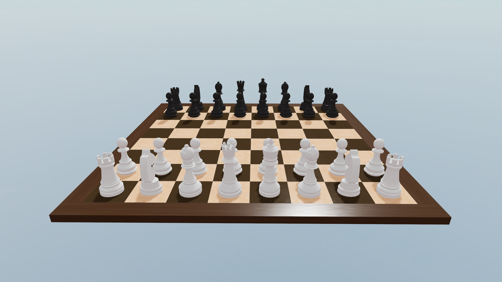
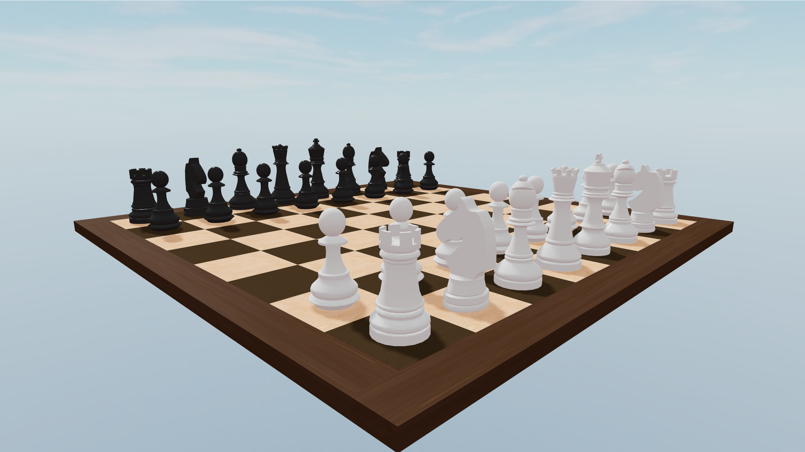

# 3D Chess in React

3D chess in React using [three.js](https://github.com/mrdoob/three.js/) and [react-three-fiber](https://github.com/pmndrs/react-three-fiber).

Made for fun.

[Try it on Code Sandbox](https://codesandbox.io/s/playable-chess-board-ngw2h)

## Screenshots

